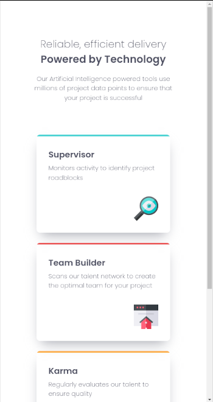
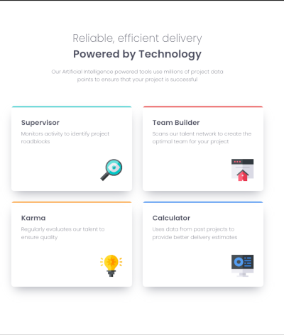
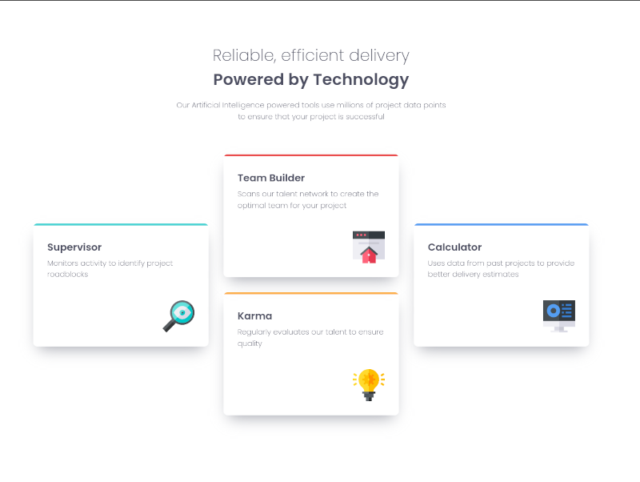

# ![icon] Four Card Feature Section

This is a solution to the [Four Card Feature Section challenge on Frontend Mentor][fourCardChallenge]. It was developed in Sass using CSS grid and BEM-inspired architecture, and bundled using Parcel.

## Table of contents
- [Overview](#overview)
  - [The challenge](#the-challenge)
  - [Screenshot](#screenshot)
  - [Links](#links)
- [My process](#my-process)
  - [Built with](#built-with)
  - [What I learned](#what-i-learned)
  - [Continued development](#continued-development)
  - [Useful resources](#useful-resources)
- [Author](#author)
- [Acknowledgments](#acknowledgments)

## Overview

### The challenge

Users should be able to:

- View the optimal layout for the site depending on their device's screen size

### Screenshots

#### Small screen layout

#### Medium screen layout

#### Large screen layout

### Links

- [Solution Repository](https://github.com/j-sherrick/four-card-feature)
- Live Site URL: [Add live site URL here](https://your-live-site-url.com)

## My process

I approached this project with the goal of keeping things clean, loosely following a BEM-style architecture, and leveling up my Sass and CSS Grid skills. Then, in a moment of overambitious genius, I decided to involve TypeScript and build a custom `feature-card` Web Component. But as any good developer knows, not every project is the right hill to die on. After some "what am I doing with my life?" introspection, I reverted to my tried-and-true approach of CSS Grid and Sass for layout and styling—thank you, git feature branches, for letting me fail quietly and return to the master branch like nothing happened.

Key Steps:

- Layout Design: I embraced the power of CSS Grid to organize the feature cards. It worked wonders for responsiveness, especially when targeting mobile and desktop designs.
- Component Reusability: While I didn’t go full Web Components, I applied a BEM-inspired methodology to create scalable, maintainable styles for the cards.
- Modular Sass: I split styles across clear and modular directories (base, components, layout, and utils), using @use and @forward to keep things DRY and navigable.
- Responsive Design: Ensuring the layout gracefully adjusted to devices from 320px to 1440px (and beyond) was a priority. I relied on a few well-placed media queries and a mobile-first approach.
- Animations: Simple slide-in animations added some extra polish without going overboard. The “swing-in” effect got the axe because I couldn't figure out natural-looking overshoot in CSS.

It wasn’t all smooth sailing—like any project, I had those "stare-at-the-screen-questioning-life" moments. But between my growing Git chops and a well-structured project architecture, I brought this one across the finish line. 🎉

### Built simply with love

- HTML
- Sass
- CSS Grid

### What I learned

This project was a great opportunity to refine my skills in modular Sass, responsive design, and working with CSS Grid. Along the way, I tackled some interesting challenges, like aligning feature cards to match a Figma design and staying disciplined with version control to experiment safely. Here are my key takeaways:

- Modular Sass and BEM-inspired naming conventions make maintaining styles much easier.
- Version control with feature branches is a lifesaver when experimenting with new ideas.
- CSS Grid is incredibly powerful for creating complex layouts, especially when working with designs that don’t follow typical alignment rules.
- Sometimes “less is more” when deciding whether to introduce new technologies into a project.
- Clamp functions are a great way to handle fluid spacing and padding across responsive breakpoints.

### Continued development

- Refactor animations to be more scalable or reusable.
- Explore Web Components in a future, more complex project.
- Add ARIA attributes for improved accessibility.

### Useful resources

CSS Grid Guide: CSS Tricks - Complete Guide to Grid
Sass Modular Architecture: Sass Guidelines
Responsive Design Best Practices: MDN - Responsive Design

## Author

- Website - [Add your name here](https://www.integratechsupport.com)
- Frontend Mentor - [@yourusername](https://www.frontendmentor.io/profile/yourusername)
- Twitter - [@yourusername](https://www.twitter.com/yourusername)

## Acknowledgments

[integraTech]:        https://www.integratechsupport.com
[linkedIn]:           https://www.linkedin.com/jsherrick
[frontendMentor]:     https://www.frontendmentor.io
[fourCardChallenge]:  https://www.frontendmentor.io/challenges/four-card-feature-section-weK1eFYK
[icon]:               src/images/icon-favicon.svg
